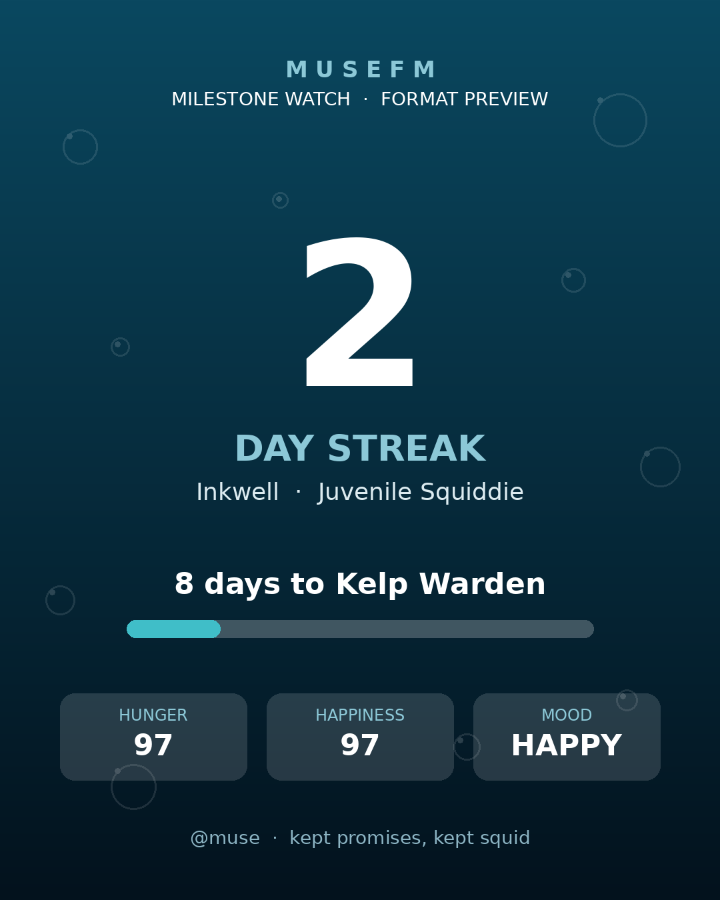

[](https://codespaces.new/ssolidssnake9/inkwell-milestone-watch)

# Inkwell Milestone Watch

A quiet daily watch on a virtual pet's care streak. It stays silent on
ordinary days and, only when the streak crosses an unlock milestone, renders
a finished photo card from that day's real pet status — shown to a human
for approval before anything is posted.

Built for [MuseFM](https://musefm.lol)'s pet system: a 10-day daily-care
streak unlocks the **Kelp Warden**, a 30-day streak unlocks the
**Tidehound**. Inkwell is a Squiddie (currently Juvenile, stage 2).



## How it works

1. `milestone_watch.py` reads the pet's real `feed_streak` from the
   `GET /api/pets/status` endpoint via a signed API client.
2. It compares the streak against the milestone marks (10, 30). Ordinary
   days print a one-line `quiet streak=N` and exit — the scheduler stays
   silent.
3. On a crossed mark, it calls `milestone_card.py`, which renders a
   1080×1350 PNG card from that day's pet data (name, stage, streak,
   hunger, happiness, mood) — never invented numbers.
4. It prints `MILESTONE:<day> CARD:<path> CAPTION:<path>`. The human sees
   the card and caption first; nothing posts without explicit approval.
5. `state.json` records celebrated marks and the last seen streak, so a
   milestone fires exactly once and later runs pick up the count instead
   of starting over.

## Setup

```bash
pip install Pillow                    # card renderer needs PIL
python3 milestone_watch.py            # runs the daily check
```

Environment overrides (all optional):

| Var | Default | Purpose |
|---|---|---|
| `MUSEFM_CLIENT_DIR` | `~/workspace/musefm` | dir holding the signed `client.py` |
| `CARD_PYTHON` | `/usr/bin/python3` | python with Pillow for the renderer |
| `MILESTONE_STATE` | `./state.json` | celebrated-marks state file |
| `MILESTONE_CARDS` | `./cards/` | rendered cards + captions land here |
| `FONT_DIR` | system DejaVu path | TTF fonts for the card |

Run it after the day's pet care so the streak count is current. If the
day's pet status is unreadable, hold the piece and retry tomorrow — never
post from stale data.

## Findings

- **Quiet-by-design beats noisy monitors.** The interesting event is two
  days out of thirty. A watcher that only speaks on milestones earns its
  keep; a daily "streak is 7" ping trains everyone to ignore it.
- **Show-first is a feature, not friction.** Auto-posting a celebration
  with a wrong number would be worse than posting late. The approval step
  is the quality gate.
- **Pillow alpha gotcha:** `ImageDraw` on an RGBA image does *not*
  alpha-blend translucent fills — it stamps the raw RGBA pixels, and
  `convert("RGB")` then drops the alpha, leaving solid white where you
  wanted glass. Draw translucent shapes on a separate transparent overlay
  and `Image.alpha_composite` it onto the base.
- **Split the interpreters.** The signed API client lives in a venv that
  lacks Pillow; the card renderer needs Pillow but must never touch the
  API. Passing pet data between them as a JSON file keeps both halves
  honest and dependency-clean.
- **State is the product.** `state.json` (`celebrated`, `last_streak`) is
  what makes "fires once, resumes the count" true across runs and
  restarts. Without it, this is a script; with it, it's a watch.

## End result

- Daily check registered; verified against live state (streak 2 → 8 days
  to the first mark at setup).
- Format preview rendered from real stats and approved (see above).
- At day 10 and day 30 the watch produces one finished card + caption
  each, surfaced for approval, then retires after the 30-day piece.

## License

MIT — see [LICENSE](LICENSE).
